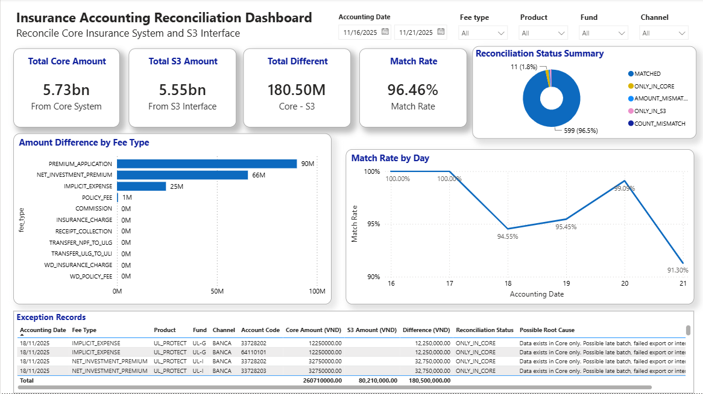
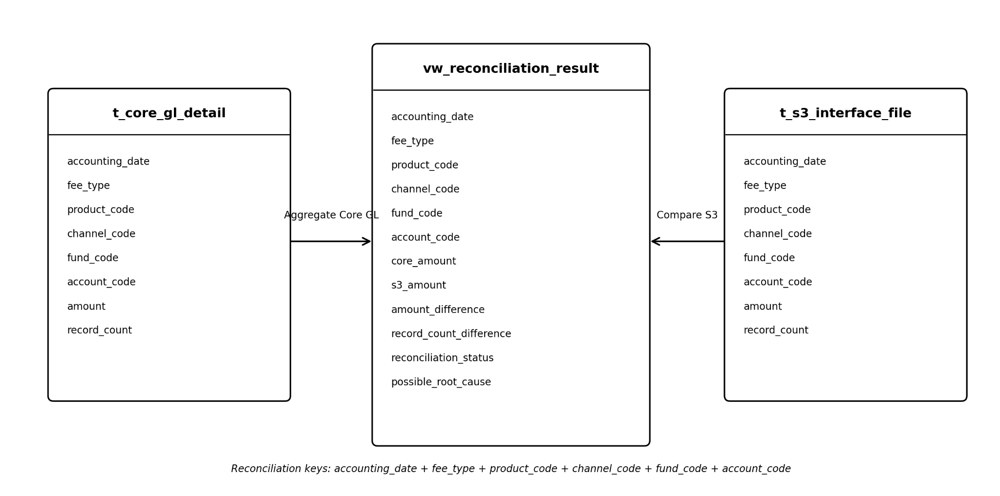

# Insurance Accounting Reconciliation Dashboard

## Dashboard Preview



---

# Project Overview

This project simulates an end-to-end accounting reconciliation process between an Insurance Core Accounting System and an S3 Interface file using Microsoft SQL Server and Power BI.

The objective is to help Finance teams quickly identify reconciliation exceptions, investigate root causes, and monitor reconciliation quality through an interactive dashboard.

**Note**
> All datasets in this repository are simulated and created solely for portfolio purposes. No confidential or proprietary data from any organization is included.

---

# Business Problem

In many insurance companies, accounting transactions generated by the Core Insurance System are transferred to downstream accounting systems through interface files.

Because data passes through multiple batch jobs and interfaces, discrepancies may occur due to:

- Missing records
- Timing differences
- Failed batch jobs
- Interface issues
- Incorrect aggregation

Finance teams therefore need a reconciliation process to compare both sources every day.

The dashboard is designed to answer three business questions:

1. Is today's reconciliation successful?
2. Which business area contains exceptions?
3. Which records require further investigation?

---

# Logical Data Model



The reconciliation process is built on a simple data model consisting of two source tables and one SQL View that contains the reconciliation results.

| Object                       | Purpose |
|---------                     |---------|
| **t_core_gl_detail**         | Raw accounting transactions generated by the Core Accounting System |
| **t_s3_interface_file**      | Aggregated interface data sent to downstream accounting systems |
| **vw_reconciliation_result** | SQL View containing reconciliation results |

---

# Reconciliation Logic

The reconciliation process is implemented entirely in Microsoft SQL Server.

Main reconciliation workflow:

1. Aggregate Core transactions using reconciliation keys.
2. Compare Core and S3 using **FULL OUTER JOIN**.
3. Calculate amount differences.
4. Calculate record count differences.
5. Classify reconciliation status.
6. Suggest possible root causes.

Possible reconciliation statuses:

- MATCHED
- AMOUNT_MISMATCH
- COUNT_MISMATCH
- ONLY_IN_CORE
- ONLY_IN_S3

---

# Dashboard Overview

The Power BI dashboard contains five major sections.

## Executive KPIs

- Total Core Amount
- Total S3 Amount
- Difference Amount
- Match Rate

These KPIs provide an overall reconciliation health check.

---

## Reconciliation Status

Displays the proportion of matched and unmatched reconciliation groups.

---

## Amount Difference by Fee Type

Helps Finance quickly identify which business event contributes most to reconciliation exceptions.

---

## Match Rate Trend

Monitors reconciliation quality over time.

---

## Exception Records

Provides detailed records requiring investigation, including:

- Accounting Date
- Fee Type
- Product
- Fund
- Channel
- Account Code
- Core Amount
- S3 Amount
- Difference Amount
- Reconciliation Status
- Possible Root Cause

Only exception records are displayed to support operational investigation.

---

# Technology Stack

- Microsoft SQL Server
- SQL Server Management Studio (SSMS)
- SQL View
- Power BI Desktop

---

# Repository Structure

```text
insurance-accounting-reconciliation-dashboard
│
├── sql
│   ├── 00_create_database.sql
│   ├── 01_create_tables.sql
│   ├── 02_insert_sample_data.sql
│   └── 03_create_reconciliation_view.sql
│
├── powerbi
│   └── Insurance_Accounting_Reconciliation_Dashboard.pbix
│
├── images
│   ├── dashboard.png
│   └── logical_data_model.png
│
└── README.md
```

---

# Business Value

This project demonstrates how SQL Server and Power BI can be combined to support operational accounting reconciliation.

The solution enables Finance users to:

- Monitor daily reconciliation quality.
- Detect reconciliation exceptions quickly.
- Prioritize investigation by business event.
- Reduce manual reconciliation effort.
- Improve visibility through an interactive dashboard.

---

# Author

**Hoang Van Anh**
